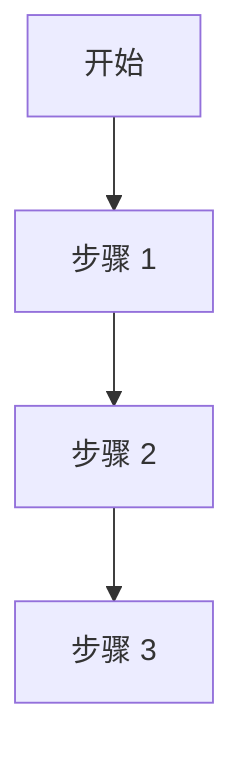

# PRODUCT_PRD_v1.md 模板

- 文档类型：基线文档
- 当前状态：active
- 当前版本：v1.0
- 最后更新时间：[YYYY-MM-DD]
- 当前负责人：[项目负责人姓名 / AI / Codex]
- 是否为当前有效版本：是

---

# [项目名称] PRD v1

## 1. 文档信息

- 文档名称：[项目名称] PRD v1
- 产品阶段：[MVP 定义版 / MVP 开发版 / v1 迭代版]
- 文档用途：用于产品、设计、前端、后端、算法、Codex 协同开发对齐
- 目标：明确产品要解决的问题、用户路径、功能边界、输入输出、页面结构与验收标准

---

## 2. 产品概述

### 2.1 产品名称（暂定）
- [名称 1]
- [名称 2]

### 2.2 产品一句话定义
[写清楚项目一句话定义]

### 2.3 产品定位
[写清楚它是什么，不是什么]

核心特点：
- [特点 1]
- [特点 2]
- [特点 3]

### 2.4 产品愿景
[写清长期愿景]

---

## 3. 背景与问题定义

## 3.1 用户背景
- [场景 1]
- [场景 2]
- [场景 3]

这类用户常见特征：
- [特征 1]
- [特征 2]
- [特征 3]

## 3.2 核心痛点
### 用户痛点
1. [痛点 1]
2. [痛点 2]
3. [痛点 3]
4. [痛点 4]
5. [痛点 5]

### 现有方案的问题
- [问题 1]
- [问题 2]
- [问题 3]

## 3.3 机会点
[为什么现在值得做]

---

## 4. 目标用户

## 4.1 核心用户
### 用户类型 A
- [特征]

### 用户类型 B
- [特征]

## 4.2 次级用户
- [次级用户 1]
- [次级用户 2]

## 4.3 不属于第一版核心用户
- [排除用户 1]
- [排除用户 2]

---

## 5. 产品目标

## 5.1 业务目标
- [业务目标 1]
- [业务目标 2]

## 5.2 产品目标
[清楚写出系统在本阶段需要输出什么]

## 5.3 非目标
- [当前阶段不追求内容 1]
- [当前阶段不追求内容 2]

---

## 6. 核心使用场景

## 6.1 场景一
[场景说明]

成功标准：
- [标准 1]
- [标准 2]

## 6.2 场景二
[场景说明]

成功标准：
- [标准 1]
- [标准 2]

## 6.3 场景三
[场景说明]

成功标准：
- [标准 1]
- [标准 2]

---

## 7. MVP 功能范围

## 7.1 MVP 必做功能（P0）
### 7.1.1 [功能 1]
- 功能说明
- 输入要求
- 输出要求

### 7.1.2 [功能 2]
- 功能说明
- 输入要求
- 输出要求

### 7.1.3 [功能 3]
- 功能说明
- 输入要求
- 输出要求

## 7.2 MVP 建议做功能（P1）
- [功能 1]
- [功能 2]

## 7.3 MVP 不做功能（P2/P3）
- [功能 1]
- [功能 2]
- [功能 3]

---

## 8. 用户流程

## 8.1 主流程


## 8.2 页面级流程说明
### 页面 1
- 目标
- 页面元素

### 页面 2
- 目标
- 页面元素

### 页面 3
- 目标
- 页面元素

---

## 9. 功能详细说明

对每个关键功能建议至少写：
- 功能描述
- 输入
- 输出
- 规则
- 异常提示

---

## 10. 输出内容规范

### 固定结构
- 一句话结论
- 当前问题
- 推荐动作 / 推荐结果
- 下一步建议

### 文案风格规范
- 不说教
- 不羞辱
- 不堆专业术语
- 中性、鼓励、明确

### 禁止风格
- [禁区 1]
- [禁区 2]

---

## 11. 交互与体验要求

- 响应时长目标
- 可读性目标
- 易用性目标

---

## 12. 数据输入输出定义（产品视角）

## 12.1 输入
- [输入 1]
- [输入 2]

## 12.2 输出
- [输出 1]
- [输出 2]

## 12.3 输出结构示意
```json
{
  "summary": "",
  "items": [],
  "next_step": ""
}
```

---

## 13. 成功标准与验收指标

### 产品验收标准
1. [标准 1]
2. [标准 2]

### 技术验收指标
- [指标 1]
- [指标 2]

### 用户体验指标
- [指标 1]
- [指标 2]

---

## 14. 边界与风险

### 功能边界
- [边界 1]
- [边界 2]

### 主要风险
1. [风险 1]
2. [风险 2]

### 风险应对
- [应对 1]
- [应对 2]

---

## 15. 版本规划

### v1
- [内容]

### v1.5
- [内容]

### v2
- [内容]

---

## 16. 依赖项

### 产品依赖
- [依赖 1]

### 技术依赖
- [依赖 1]

### 测试依赖
- [依赖 1]

---

## 17. 附录（可选）

- 首页文案草案
- 结果页文案草案
- 术语说明

---

## 18. 结论

[用 1~3 段收束本阶段产品聚焦点]
