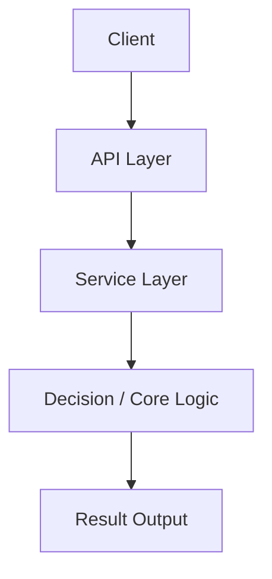

# TECH_ARCHITECTURE_v1.md 模板

- 文档类型：基线文档
- 当前状态：active
- 当前版本：v1.0
- 最后更新时间：[YYYY-MM-DD]
- 当前负责人：[项目负责人姓名 / AI / Codex]
- 是否为当前有效版本：是

---

# [项目名称] 技术架构文档 v1

## 1. 文档信息
- 文档名称
- 适用阶段
- 文档用途
- 目标

## 2. 设计目标
- 当前为什么需要这份架构文档
- 它解决哪些跨模块协同问题

## 3. 架构原则
- 先最小闭环，再增强
- 先稳定接口，再优化内部
- 模块边界明确
- 关键层可替换

## 4. 总体架构图

## 5. 分层说明
### 5.1 客户端层
### 5.2 API 层
### 5.3 服务编排层
### 5.4 核心逻辑层
### 5.5 数据 / 存储层
### 5.6 可视化 / 结果层（如有）

## 6. 核心模块边界
| 模块 | 职责 | 输入 | 输出 | 依赖 |
|---|---|---|---|---|
| [模块] | [职责] | [输入] | [输出] | [依赖] |

## 7. 数据流与调用链
- 主流程调用链
- 异常路径
- 同步 / 异步策略

## 8. 可替换组件策略
- 哪些能力可替换
- 替换时必须保持什么稳定

## 9. 技术选型建议
- 前端
- 后端
- 模型 / 引擎 / 外部服务

## 10. 风险与边界
- 当前阶段不做什么
- 当前已知架构风险
- 当前兜底策略

## 11. 推荐开发顺序
1. [第一步]
2. [第二步]
3. [第三步]
