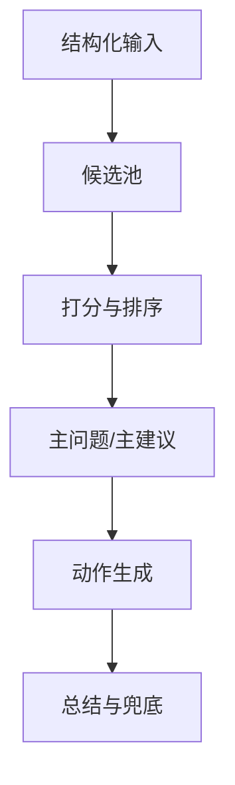

# TECH_RULES_ENGINE_SPEC_v1.md 模板

- 文档类型：基线文档
- 当前状态：active
- 当前版本：v1.0
- 最后更新时间：[YYYY-MM-DD]
- 当前负责人：[项目负责人姓名 / AI / Codex]
- 是否为当前有效版本：是

---

# [项目名称] 规则引擎设计文档 v1

## 1. 文档信息
- 文档名称
- 适用阶段
- 文档用途
- 文档目标

## 2. 文档定位
[说明规则引擎在系统中的角色]

一句话定义：
**规则引擎负责把“结构化事实”翻译成“用户或系统能立刻执行的动作/决策”。**

## 3. 设计目标

### 3.1 核心目标
1. 识别当前最重要的问题 / 决策点
2. 排出主次，不一次输出过多信息
3. 生成最适合当前场景的主建议
4. 生成可执行的动作 / 指令 / 下一步
5. 在前置能力不稳定时提供可控兜底

### 3.2 非目标
- 审美绝对正确
- 无限复杂场景编排
- 长期个性化学习
- 逐帧复杂规划

## 4. 总体设计原则

### 原则 1：先判断“最大问题”，再判断“所有问题”
### 原则 2：优先输出可执行动作，而不是抽象建议
### 原则 3：优先推荐最省力的修正路径
### 原则 4：先救场，再增强
### 原则 5：一句指令只做一件事
### 原则 6：输出必须克制

## 5. 引擎输入与输出

### 5.1 输入
- [结构化输入 1]
- [结构化输入 2]
- [模式 / 场景 / 上下文]

### 5.2 输出
- `problem_diagnosis`
- `recommendation`
- `instruction_set`
- `result_summary`
- `retry_needed`
- `retry_focus`
- `result_level`

## 6. 决策流程总览


## 7. 基础输入字段与规则引用
- 场景输入字段
- 主体输入字段
- 风险输入字段

## 8. 候选池设计

### 8.1 候选池定义
```json
{
  "code": "",
  "triggered": true,
  "severity": "high",
  "score": 0.9,
  "reason": ""
}
```

### 8.2 候选问题来源
- 硬规则直接触发
- 多字段组合推断

## 9. 问题识别规则

对每个高频问题建议至少写：
- 触发条件
- 建议评分逻辑
- 输出影响

### 9.1 [问题 code 1]
#### 触发条件
#### 建议评分逻辑
#### 输出影响

### 9.2 [问题 code 2]
#### 触发条件
#### 建议评分逻辑
#### 输出影响

## 10. 问题打分机制

### 10.1 打分目标
- 选主问题
- 选展示问题
- 选值得说的问题

### 10.2 问题总分公式（建议版）
```text
final_score = base_severity_score * confidence_score * mode_weight * scene_weight * usability_weight
```

### 10.3 因子说明
- `base_severity_score`
- `confidence_score`
- `mode_weight`
- `scene_weight`
- `usability_weight`

## 11. 主问题选择规则
- 优先级最高者
- 分数接近时优先更易执行修正者
- 能联动改善多个问题者优先

## 12. 展示规则
- 展示数量
- 展示筛选原则
- 展示顺序

## 13. 推荐规则
- 主推荐集合
- 子类集合
- 推荐逻辑总则
- 各场景推荐规则

## 14. 指令生成规则
- 指令生成目标
- 指令优先级顺序
- 单问题到指令映射
- 去重规则
- 数量规则
- 文案模板

## 15. 重拍 / 重试 / 复算判断规则
- 何时建议重试
- 何时可直接通过
- 何时只需微调
- `retry_focus` 生成规则

## 16. 文案映射规则
- code 到用户文案映射
- 总结文案模板
- 文案禁区

## 17. 兜底逻辑设计
- 兜底目标
- 异常场景兜底
- 最小兜底结果

## 18. 规则优先级矩阵（建议版）
| 问题 code | 默认优先级 | 模式权重 | 是否易执行修正 | 是否高频展示 |
|---|---:|---:|---|---|

## 19. 伪代码示意
```python
def run_rules_engine(input_data):
    ...
```

## 20. 测试用例建议
- 高频测试场景
- 测试关注点
- 冲突指令示例

## 21. 版本迭代建议
- v1
- v1.5
- v2

## 22. 结论
[说明本规则引擎最重要的三个原则]
